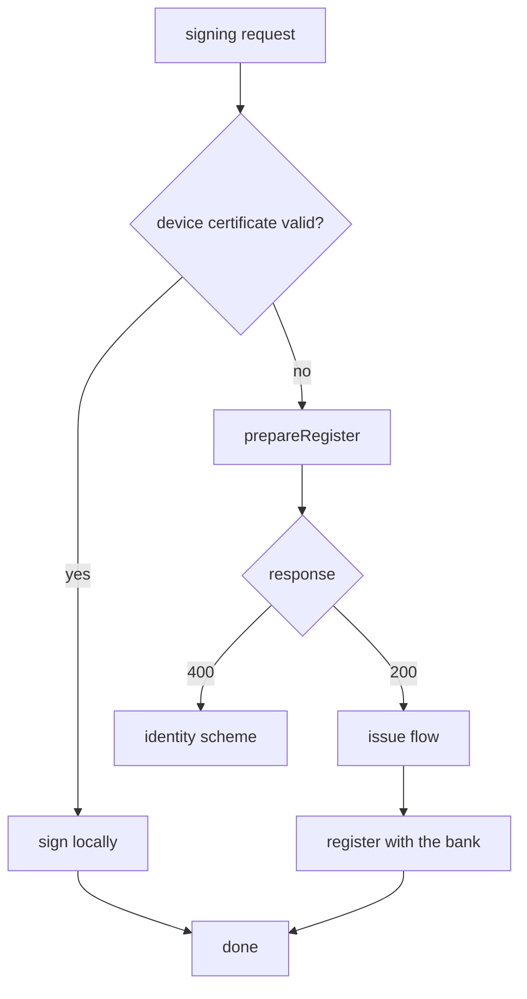
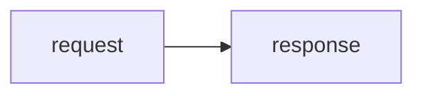
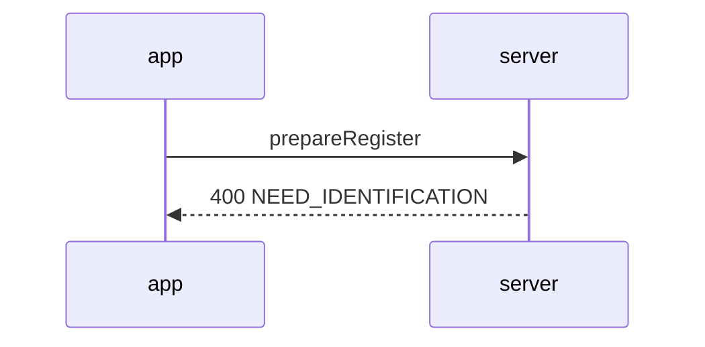

# analysis-doc components

This document uses every component the shell supports, once each. Copy from here to start a new analysis.

A diagram can take a name after the fence. That name is the caption, the name in the canvas list, and the address its layout is stored under. Name the diagrams you intend to work on in the canvas.

## Callouts

:::note what this rests on
The server code is the truth. A comment on the client is not.
:::

:::ok confirmed
`prepareRegister` branches on `level` and nothing else.
:::

:::warn careful
With `identifyList` at `nil`, the `requiresRenew` check is skipped entirely.
:::

:::danger defect
The 200 response is thrown away with `_ =` and the function simply ends. It returns without doing anything.
:::

## Steps

Everything inside a container uses the same syntax as the body. The mermaid block in item 2 below is drawn as a diagram and reaches the canvas list.

:::steps
1. **call prepareRegister** with `level: .lv2`

2. **branch on the response**: 200 issues, 400 goes to the scheme

   ```mermaid
   graph LR
     Q{response} -->|200| I[issue]
     Q -->|400| S[open scheme]
   ```

3. **sign** with `sign(authMethod:type:document:)`
4. **register** with `register(clientID:signedDocument:identifyToken:userNo:)`
:::

## Two columns

:::compare web | native
Treats success as the main path and handles `moveScheme` as the exception.

```ts
const { data } = await prepareRegister({ level: 'LEVEL2', identifyList })
```
---
Treats errors as the main path, and half of the success path is missing entirely.

```swift
_ = try await prepareRegisterCertificate(level: .lv2, identifyList: nil)
```
:::

## Diagrams

A named diagram. It gets a caption, and its layout can be changed on the canvas.



An unnamed diagram. No caption, only the toolbar, and read only on the canvas.



A diagram on a different axis is drawn in the body only. The canvas reads nodes and edges.



## Call trace

```trace
title: the signing entry path
- app | `sign(request:)` | TossBankCertificateService:44
- app | `attemptSign(...)` returns nil | every certificate type failed
? app | `attemptRestoreOrIssue()` | branches on whether restore is possible
- server | `POST /api/certificate/toss/prepare/register` | level=LEVEL2
! server | 400 `NEED_IDENTIFICATION_RESULT` | errorData.moveScheme
+ app | opens the scheme | URLSchemeRouter
```

## Tables

| item | web | native |
|---|---|---|
| main path | 200 | 400 |
| identifyList | always sent | `nil` |
| what follows | unifiedLaunchV2 | nothing |

## Canvas only graph

mermaid node shape notation is taken as it is, and drawn as the same shape on the canvas.

```canvas issue and register path
graph LR
  S[server] --> V([verify])
  V --> T{{issue identifyToken}}
  T --> D[(certificate DB)]
  D --> C{valid}
  C -->|yes| R[[register]]
  C -->|no| X(((end)))
  R --> P[/response/]
  P --> E((done))
```
