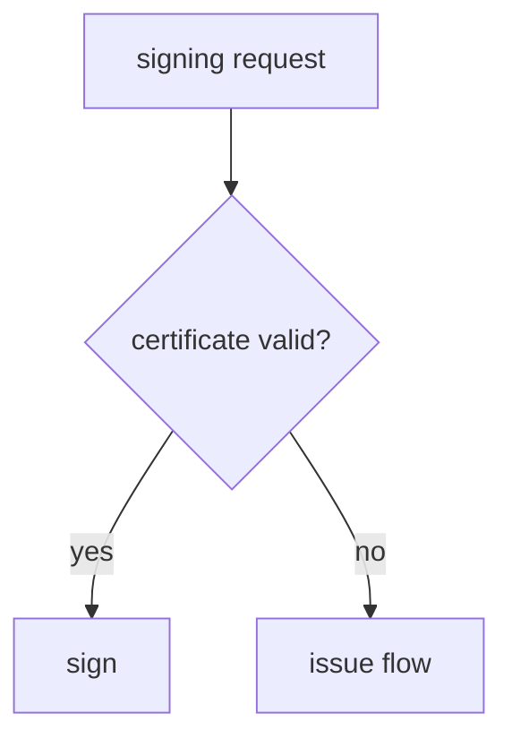
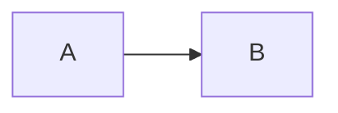

# analysis-doc

Syntax SSoT. Everything you can write and how to write it. For when and why to use it, and for install and verify, see `../README.md`.

Write the analysis as **one markdown file** and bake it with a fixed shell into a **self contained HTML document**. The shell (layout, style, runtime) is fixed and lives in `../source/`. The only thing that changes per document is the markdown, so every analysis comes out with the same page around it.

```
open-package build <content.md> [-o <out.html>]
```

Leave `-o` out and it bakes next to the input with the extension swapped (`flow.md` becomes `flow.html`).

The output is a single file with no external requests. marked and mermaid are carried inside it. It opens the same way on a corporate network, offline, or uploaded to Slack.

Only the mermaid a document draws goes in. Flowcharts alone come to about 900KB, and a document with no diagram to about 180KB, against 3.4MB for the whole of mermaid. The build prints what it put in.

## Design

Tokens follow [herdr.dev](https://herdr.dev). Warm paper in light (`#f0eee9` on `#1a1a18`), ink in dark (`#0c0c0b` on `#f0ece0`), one blue accent (`#4a9eff`), tight radii (2, 4, 6px), hairline borders, almost no shadow. Type is Archivo for headings, Inter for body, JetBrains Mono for labels, code and canvas, falling back to system fonts where those are missing. The document is self contained, so no web fonts are fetched.

Labels (kicker, table headers, `####`, toolbars) are mono, uppercase, wide tracking. That is the axis that gives the document its look, so an individual document does not overturn it.

## The page (fixed)

| area | what it holds |
|---|---|
| top left | kicker, title, subtitle |
| view switch | **Doc**, **Source** (the markdown as it is), **Canvas** |
| left panel | In doc and source view, the contents (`#`, `##`, `###`, `####` collected automatically. The current position is highlighted and the contents scroll to keep it in view, and pressing an entry from the source view goes back to the document and moves there). In canvas view, the diagram list and the inspector for the selected node or edge |
| bottom left | Icon actions: download MD, copy MD, print. Theme toggle on the right (system, light, dark, showing the current state in the icon and its colour) |
| right | The body, one vertical scroll |

The theme is the reader's rather than the document's, so the choice is kept under one key for every analysis-doc and holds across all of them. It is applied in the `<head>`, before the shell paints, so opening a document in a stored dark does not start with a frame of light. Where the browser blocks storage the toggle still works and the choice lasts until the page is closed.

Colours in a mermaid diagram are baked into the SVG, so they do not follow a CSS variable on their own. Changing the theme reinitialises with the tokens at that moment and redraws everything. A system theme change does the same.

"Export MD" hands back **the original markdown the build used**, byte for byte. The markdown is always the original and the HTML is a view. The **Source** view shows that same value on screen, so download, copy and view cannot disagree. To see one diagram's source, **show source** (`<>`) in the figure toolbar unfolds that block alone.

## frontmatter

```yaml
---
title: Native signing flow
kicker: TossBank iOS
subtitle: 2026-08-28 draft
slug: native-sign-flow        # canvas storage key and export filename
---
```

All optional. Without `title`, the first `#` heading is used.

## Components

Ordinary markdown (tables, code, quotes, lists) works as it is, and the following is added.

A table is measured at the width where none of its text wraps. If that is more than the text column it reaches past the column, up to what the window holds, and stays centred on it. Beyond that the reader drags a boundary in the header row: the column left of it takes the new width, the other columns keep theirs, and the table takes the difference. Double click a boundary and the table goes back to the measured widths. A table inside a callout or a comparison stays in that block and scrolls sideways instead. Nothing here is stored, and reopening the document measures again.

One markdown rule bites Korean harder than English. A closing `**` that sits straight after punctuation, with a letter and no space after it, does not close the emphasis:

```
**"원문"**을 보낸다              stays as asterisks
**`prepareRegister`**를 부른다   stays as asterisks
**서명 요청**을 보낸다            bold, since the closer follows a letter
```

English has the same rule (`**"like this"**then` does not close either) and meets it far less often, because a space usually sits where a Korean particle attaches. This is CommonMark rather than anything this shell does, so GitHub reads it the same way. Put the punctuation outside the emphasis and it works: `"**원문**"을 보낸다`. The `:::` container and the fenced blocks are **shapes that live inside markdown syntax**, so an exported `.md` still reads as prose in another viewer. What that viewer will not dress up is the notation only this shell knows: ` ```canvas `, and the `:::` names.

### Diagrams: ```mermaid

```` 

````

A rendered diagram gets **show source** (`<>`), download SVG, and **enlarge**. Show source unfolds that block's mermaid text in place of the diagram, and pressing it again goes back. In the enlarged view, wheel zoom, drag pan, and the zoom in, zoom out and fit buttons come alive, and `Esc` closes it. A `graph` or `flowchart` block **also goes on the flow canvas automatically.**

What a block declares is decided by its **first effective line**. A mermaid frontmatter block (`---`), a `%%{init:...}%%` directive, a `%%` comment and blank lines before it are skipped. That is why a flowchart carrying a theme directive still lands on the canvas.

Diagrams on a different axis, like `sequenceDiagram`, `stateDiagram` and `pie`, are drawn in the body only and do not go on the canvas. The canvas does not render mermaid. It reads the nodes and edges and lays them out itself.

**Naming a diagram.** Write it straight after the fence. That name is the caption and the name in the canvas list. **Only a named diagram gets a caption**, and without one the toolbar carries buttons alone. Pulling the heading above it in as a caption would only repeat the same words one line down, so there is no fallback on the document side.

````

````

**The canvas list** cannot hold an empty name, so the fallback lives there and only there: the nearest heading above, and `Title (1)`, `Title (2)` when a section holds several. That is a question of what to write in a list, nothing more.

**Only a named diagram can have its layout changed on the canvas.** The overlay's address comes from that name alone. No name means no address, and inventing one puts your changes on somebody else's diagram. Order of appearance shifts as soon as one diagram is inserted, and a heading is a position rather than a name, so it disappears the moment a section is renamed. An unnamed diagram therefore **opens read only**: viewing, focus and save/load still work, and the inspector does not open. Give the same name twice and the first one keeps the address while the second locks.

### Canvas only graphs: ```canvas

For a graph you do not want drawn in the body but do want on the canvas. The syntax is the same as a mermaid flowchart, and it goes on the canvas without the `graph` or `flowchart` check.

The body keeps **the same toolbar as a figure** with no body under it: go to canvas, and show source (`<>`), same place, same buttons. Show source unfolds the text there. Nothing differs except that it is not drawn.

**This fence belongs to this shell.** Open an exported `.md` in GitHub or Obsidian and a ` ```mermaid ` block draws while this one shows as a code block. In exchange it does not fill the body with a diagram.

### Callouts: `:::note` `:::ok` `:::warn` `:::danger`

Whatever follows the name on the opening line is the callout title. Without it there is no title row, only the body.

```
:::danger this is where it breaks
A 200 can come back even with `identifyList: nil`.
:::
```

### Steps: `:::steps`

```
:::steps
1. **call prepareRegister** with level=LEVEL2
2. **branch**: 200 issues, 400 goes to the scheme
:::
```

### Two columns: `:::compare left | right`

```
:::compare web | native
Treats success as the main path.
---
Treats errors as the main path.
:::
```

Everything inside a `:::` container uses the same syntax as the body. Put a mermaid, canvas or trace block in and it draws, and it reaches the canvas. Containers nest, and a code block demonstrating the `:::` syntax itself does not close the container. A graph inside inherits the outer heading for its list name, so name it inside the container too if you mean to work on it.

### Call sequences: ```trace (```seq is an alias)

A static list of the call order, as number, actor and content. The character at the start of a line is its nature, shown as a colour band on the left (`-` call, `?` branch, `!` error, `+` success). The fields are `actor | content | note`.

````
```trace
title: signing entry
- app | `sign(request:)` | TossBankCertificateService:44
- server | `POST /toss/prepare/register` | level=LEVEL2
? server | identity check on record? |
! server | 400 NEED_IDENTIFICATION_RESULT | returns moveScheme
+ app | opens the scheme |
```
````

## Flow canvas

### The markdown is the SSoT

The canvas is **a window onto the document's diagrams**, not a separate model. Every time it opens it reparses the markdown for structure (nodes, edges, labels), and `localStorage` keeps **the presentation overlay alone**: position, shape and colour per node id, colour, line, arrowhead and route per edge, and the view scale.

So:

- Fix the markdown, bake again, and **the canvas follows immediately**. The overlay of a node that is gone is dropped, a new node is placed automatically, and labels are always the document's
- **Labels and structure cannot be changed on the canvas.** They show read only in the inspector, and changing them means changing the markdown. There is nowhere for the canvas and the document to diverge
- To hand an overlay to someone else, use **Save** (JSON) and **Load**

One diagram is on screen at a time. The left panel, which holds the contents in document mode, becomes **the diagram list**, and each figure in the document gets a button that goes straight to the canvas.

The left panel is worked by **the handle on the border**. Press it to collapse and expand, drag it to change the width (210 to 560px). Drag it left past 150px and it collapses. Collapsed, the handle follows to the left edge of the screen and becomes the way back open. Both the collapsed state and the width are remembered per document.

### mermaid is only an import format

The canvas does not render mermaid. **It reads nodes, edges, labels and shapes, and ignores the rest.**

| mermaid | canvas |
|---|---|
| node id and label | yes, as they are |
| node shape `{}` `()` `[()]` `[/ /]` and the rest | yes, as the matching shape |
| edge direction, label, dashes | yes |
| `subgraph` | yes, as membership. Nested subgraphs are read, and a node belongs to the innermost one holding it |
| `graph TD` / `LR` direction | ignored. The canvas decides the layout |
| `classDef` `style` `linkStyle` `click` | ignored. Colour and line come from the inspector |

So the figure in the body (rendered by mermaid) and the one on the canvas are **the same structure laid out differently**. There is no need to think about the direction declaration.

A subgraph is laid out as one thing. The levels are taken on the graph with each group folded into a single unit, so a group holds a run of columns rather than being torn apart wherever the flow leaves it and comes back. Inside the run the members are levelled again among themselves, and the members hold the same rows across every column the group spans. What this costs is that a column is no longer the distance from the entry: a node the flow reaches late can stand early, in its group's run, with the edge running back to it. A document with no subgraph folds nothing, and the fold of a plain graph is the graph, so it lays out as it always did.

Nesting is read but not drawn as containment. An inner subgraph is a group of its own next to the outer one rather than inside it.

Layout is computed automatically with longest path layering and barycenter ordering. For edges, **all 16 combinations of the four sides on each end are scored** and the cheapest pair wins. The score is the distance between the two ports plus a penalty when the space in front of a port is blocked, and the penalty has two tiers: heavy when the target sits **behind** the port, light when it is in front but merely tight. No axis is fixed in advance, so **out the top and in the left** comes up too, which is the most natural thing for two nodes on a diagonal. A route leaves and arrives along the port normal, so the arrowhead angle matches the entry direction on its own.

The shape of the route follows the relationship between the ports.

| port relationship | route |
|---|---|
| facing or at right angles, head on distance at least half the sideways spread | curve |
| facing or at right angles, otherwise | orthogonal, with the bend confined **between** the two ports |
| looking the same way (down to down and so on) | a short U just outside the two nodes |
| facing, but the target is behind | a lane wrapping both nodes |

An orthogonal route on a pair looking the same way runs its last segment backwards and flips the arrowhead. A curve on a relationship spread wide sideways sends the control points past each other and folds into an S. Both were found by sweeping layouts on a grid.

The arrowhead angle is **computed and written in** rather than left to SVG's `orient="auto"`. `auto` uses the instantaneous tangent at the end point, and when a curve arrives on a tight bend that tangent differs from the direction the eye sees, so the arrowhead alone points elsewhere. The route is flattened to a polyline and the direction traced back from the end **only while it holds** becomes the angle (always for the first 2px, then stopping at a bend over 2 degrees, up to 13px). Averaging over a fixed length lets the average eat past the corner when the last straight run is short, and the angle comes out a few degrees off.

The line is not bent to match the arrowhead. Straightening the approach by force was tried, and the end angle of the curve disagreed with that straight run, which left a visible kink. The arrowhead follows the line and that is enough.

Obstacle avoidance, routing around other nodes, is not in. Measured as a penalty, the number of crossings stayed the same and only the detours grew, so it came out as complexity that bought nothing. Overlap two nodes and a line has no choice but to cross one of the boxes, and that is a layout problem rather than a routing one. Sweeping layouts on a grid shows the line does not swing far outside the box around the two nodes even when they overlap. With the target in front of the exit port it curves (or takes an orthogonal route with one bend in the middle when far), and **only when the target is behind the port** does it go around in a lane outside both nodes.

Drag a node and **snapping** catches it. Your left, centre and right go onto another node's left, centre and right (and top, middle, bottom), and the guide shows as a dotted line while it holds. Only **the nodes currently on screen** count, so nothing pulls toward a node you cannot see. With no guide in range it snaps to a 10px grid alone. The tolerance is 9px in screen terms, so it feels the same at any zoom. The **Snap** button at the top turns it off and on, and the state is remembered per document. It is on by default.

The **minimap** at the bottom right holds the whole graph shrunk down, with what you are looking at marked as a blue rectangle. Press or drag anywhere in it and that point comes to the middle of the screen. Press the header to collapse it, and the collapsed state is remembered per document. It does not appear with two nodes or fewer.

Past 10 levels the layout is **folded like a snake** to fit the screen ratio, with odd bands reversed so the flow carries through. A cycle in the document, a failure looping back into the entry for instance, leaves the back edge out of the level calculation only. It is still drawn.

- Drag the background to pan, wheel to zoom. The toolbar carries **fit, zoom in, zoom out** and the current scale
- Drag a node to move it. Edges attached to the selected node are always highlighted in **one accent colour**, because mixing that with each edge's own colour makes "selected" look different per edge. Dragging the background does not clear the selection. Only a click in place does
- Colour is one row of presets plus the system colour picker plus direct hex entry. A value not in the presets marks the custom slot as selected
- **The inspector** is a popup on the right of the canvas, since the left is taken by the diagram list
- **Node properties**: shape, background, text, border colour, border style (solid, dashed, dotted, none), border width. The label is read only and owned by the document
- **Edge properties**: click an edge to select it. Arrowhead (triangle, open, diamond, circle, bar, none), line colour, line style, line width, route (auto, curved, orthogonal). The label is read only
- The dropdown is written here rather than the browser's, so it looks the same everywhere, and every option carries a preview of the actual shape, line or arrowhead
- The overlay saves to `localStorage` automatically, inside that browser only
- **Editing needs both: storage that can be written, and an address to write to (a name).** Missing either, that diagram opens read only. Storage is decided by actually writing once on open, which catches browsers that block a file:// document and private windows. The address is the name after the fence. Locked, a `Read only` badge stands in the toolbar and its tooltip says which one is missing. Node dragging and property editing are blocked, and snap and reset disappear because they have nothing to point at. **The inspector does not open at all**, since listing values that cannot be changed only covers the screen. Selection, focus, minimap and save/load stay. Locked is better than a moved layout quietly vanishing on the next open or landing on someone else's diagram
- **Save** (JSON) and **Load** hand the whole overlay around
- **Reset** drops the current diagram's overlay alone and goes back to the document
- **Show in doc** moves to the section this diagram sits in and highlights it
- **Focus** keeps the selected node's one hop neighbours and dims the rest
- The inspector collapses from the caret in its header. The x clears the selection

### Node shapes

mermaid notation is taken as it is and drawn as the same shape on the canvas. Diamonds, hexagons and the rest are drawn as SVG, so their border and fill stay real.

| notation | shape |
|---|---|
| `A[text]` | rectangle |
| `A(text)` | rounded |
| `A([text])` | stadium |
| `A[[text]]` | subroutine |
| `A[(text)]` | cylinder (storage) |
| `A((text))` | circle |
| `A(((text)))` | double circle |
| `A{text}` | diamond (branch) |
| `A{{text}}` | hexagon (prepare) |
| `A[/text/]` | parallelogram (I/O) |
| `A[/text\]` | trapezoid (manual) |

`-->`, `-.->` and `==>` come in as solid, dashed and thick. All of them can be changed in the inspector.

## Structure

This is an open-package. `open-package spec` explains the specification.

```
analysis-doc/
  manifest.toml             required runner version, package identity, commands. The only required file here
  README.md                 what this package is and when to use it
  document/SYNTAX.md        this document, the syntax SSoT
  document/WRITING.md       how to analyse, how to structure the document, what tone to write in
  document/EXAMPLE.md       an example using every component
  source/build.py           the builder, standard library only, no dependencies
  source/mermaid_slice.py   picks the mermaid modules a document needs
  source/fetch-vendor.sh    fetches vendor, pinned versions, sha256 checked
  source/verify.sh          bakes and checks size, self containment, leftover placeholders
  source/template.html      the shell skeleton, placeholders and no content
  source/style.css          the fixed style, light and dark
  source/app.js             the fixed runtime, markdown rendering, contents, components, canvas
  source/vendor/            marked and mermaid. Not in the repository. `open-package setup` fetches them
```

Change the shell and **every document changes with it**. Bake them again. Do not hand edit the HTML of an individual document. That is what this library exists for.

## vendor

```
open-package setup
```

Fetches marked 12.0.2 as one minified file, and mermaid 10.9.1 as the npm tarball extracted into `source/vendor/mermaid/`. Both are pinned and checked against sha256. The bytes fetched here end up inside every document baked afterwards, so a hash mismatch fails and leaves nothing behind.

To raise a version, change the version and the hash together at the top of `source/fetch-vendor.sh`.

If a corporate network blocks the registry, do not work around it. Give it a mirror. `ADOC_VENDOR_BASE` is the CDN that serves marked, `ADOC_VENDOR_REGISTRY` the npm registry that serves the mermaid tarball.

```
ADOC_VENDOR_BASE=https://<mirror>/npm open-package setup
```

### What gets baked

`source/mermaid_slice.py` does this, and `source/build.py` calls it once per bake.

**What mermaid's `dist/` looks like.** It is not one bundle. There is an entry module, a set of shared modules under it (the renderer, the theme, d3, dompurify), and one module per diagram type sitting to the side. The entry reaches a diagram type by dynamic import:

```js
// inside the entry module
import("./flowDiagram-v2-f2119625.js")
import("./sequenceDiagram-b517d154.js")
import("./mindmap-definition-307c710a.js")
```

Those calls only run when a document draws that kind of diagram. All of them together come to about 4.8MB. The entry and its shared modules come to 310KB, and adding flowcharts to that makes 590KB. The hash in each filename changes between mermaid releases, so nothing here may be pinned by filename.

**Which modules a document needs.** The build finds every ` ```mermaid ` block, reads its first effective line, and looks the word up in `DIAGRAM_MODULES`. `graph` and `flowchart` give the flowchart modules, `sequenceDiagram` gives the sequence module, and so on. It then walks the static imports of the entry and of the modules it picked, so the shared ones come along. Everything else is left out.

A ` ```canvas ` block asks for nothing. The canvas parses the nodes and edges itself and never calls mermaid, which is why a document of canvas graphs alone carries no mermaid.

**Why the modules cannot just be pasted in.** They are ES modules, and they refer to each other by relative path:

```js
import { a } from "./graph-0ee63739.js";
```

The browser resolves that against the URL of the module doing the importing. A module inlined into an HTML file has no URL of its own, so the path resolves against the document instead, which asks for a file that is not there.

So each module gets its own URL. The build hands the text to `URL.createObjectURL(new Blob([text]))` and gets back a `blob:` URL that behaves like any other module URL, then rewrites the specifiers to point at it:

```js
import { a } from "blob:null/2f0f1e0e-31c4-4d5b-9a92-1d9f0e0d0a3c";
```

A static import specifier has to be a literal string, so the URL has to exist before the module that names it is turned into a blob. That fixes the order: a module goes in after everything it imports. mermaid's `dist/` has no import cycle, so a post order over the static imports is always a valid order.

Dynamic imports take an expression rather than a literal, so those go through a lookup instead:

```js
import(__mmdUrl("flowDiagram-v2-f2119625.js"))
```

That matters because a diagram module can be made after the entry that imports it, and the lookup happens when the diagram is drawn rather than when the entry is built. A name the lookup does not have returns a module that throws, and the block falls back to showing its source.

**An unrecognised diagram type falls back to the whole of mermaid.** mermaid may have learned one `DIAGRAM_MODULES` has not, and a document that draws is worth more than a small one that cannot.

The fallback inlines `dist/mermaid.min.js`, the UMD build of the same release, rather than assembling every module. It is 3.4MB against 4.8MB for the modules, because minifying across module boundaries is what a bundle can do and a set of published modules cannot. So the worst case here is the size a document was before any of this, never more.

`app.js` takes either. The UMD puts mermaid on `window` from a classic script, the sliced modules resolve one microtask later through `window.__mermaidReady`, and the first paint waits for whichever it got.

The build prints which word it did not recognise. That line is the cue to add the word to the table.
